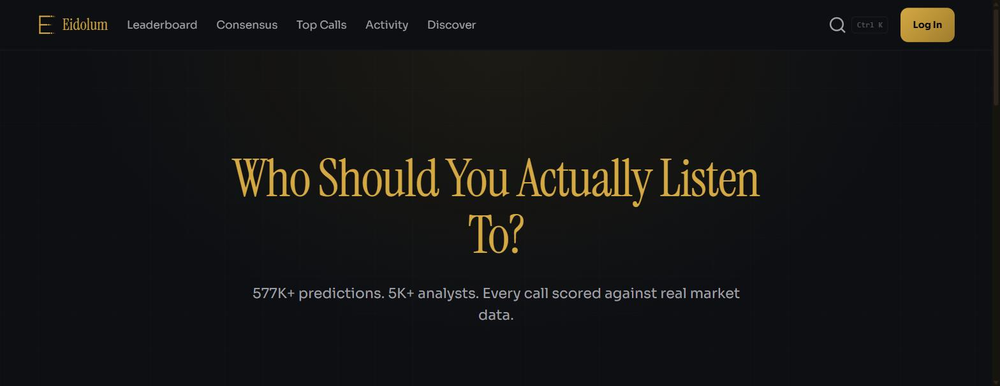
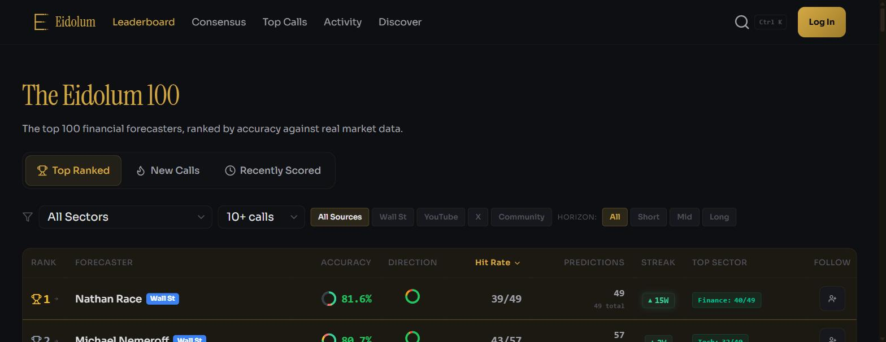

# Eidolum

   

Who should you actually listen to?

Markets are full of confident predictions, from Wall Street analysts to finance YouTubers and X/StockTwits traders, but there's rarely a real record of who was actually right. Eidolum tracks every prediction, timestamps it so it can't be edited or backdated, and scores it against real market data when its evaluation window expires. Analysts and everyday traders are ranked on the same public leaderboard, judged by the same rules.

## Live site

https://www.eidolum.com

577K+ predictions tracked, 5K+ analysts monitored, 463K+ predictions scored (live counts, growing daily).

## Where the data comes from

Licensed financial data APIs: the same class of institutional-grade market data used by trading desks, for both analyst ratings and real-time price verification.

Social predictions: tracked from X/Twitter and StockTwits, held to the same scoring standard as Wall Street.

Tamper-proof timestamps: every prediction is locked the moment it's received. It cannot be edited, backdated, or deleted.

## How scoring works

When a prediction's evaluation window expires, Eidolum looks up the actual price using licensed real-time market data and assigns one of three outcomes: HIT (reached the target within tolerance, score 1.0), NEAR (right direction, missed the target, score 0.5), or MISS (wrong direction or barely moved, score 0.0).

Accuracy = (HITs times 1.0 plus NEARs times 0.5) divided by Total Evaluated, times 100.

Tolerance scales with timeframe (a 1-year call gets more room than a 1-day call) across 7 horizons from 1 day to 1 year.

## The Seven Pillars

Every prediction must satisfy 7 criteria before it counts toward anyone's accuracy score. Vague mentions, macro commentary, and questions are rejected automatically at ingestion.

Rule 1, Specific ticker or sector ETF: a real symbol, not generic "tech stocks" commentary.

Rule 2, Identifiable direction: an explicit rating or price target, or clear directional language.

Rule 3, Specific asset: a single instrument our data providers can price, not a basket or "the market".

Rule 4, Verifiable source identity: an archived source URL, or an immutable tweet ID.

Rule 5, Bounded timeframe: one of 6 fixed evaluation windows, 1 day to 1 year.

Rule 6, Authoritative date: pulled from machine-readable metadata, never a user-supplied or parsed string.

Rule 7, Immutable record: once recorded, it cannot be edited, backdated, or deleted.

This ruleset runs with zero manual review, keeping the public leaderboard trustworthy without a moderation team.

## Features

Leaderboard (the Eidolum 100): top forecasters ranked by accuracy, filterable by sector, source, and prediction volume.

Forecaster profiles: full prediction history, sector breakdown, accuracy over time.

Consensus view: see who's bullish or bearish on any ticker, and who's historically been right.

Top Calls and Activity feed: recently scored predictions and new calls as they come in.

Player accounts: anyone can sign up and submit their own predictions to compete against Wall Street on the same leaderboard.

Gamification: badges, streaks, and seasonal leagues to keep accuracy tracking engaging over time.

LLM-assisted evaluation: a locally-hosted model helps adjudicate ambiguous submissions that fall outside the automated rules.

## Tech stack

Frontend: React plus Vite.

Backend: Python (FastAPI).

Database: PostgreSQL.

Backend hosting: Railway.

Frontend hosting: Vercel.

## Status

Actively developed and in production since early 2026, built and operated solo end-to-end: architecture, backend, frontend, deployment, and ongoing monitoring.
